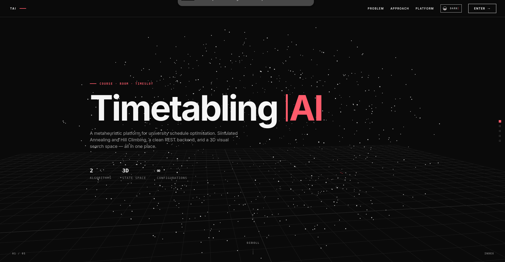
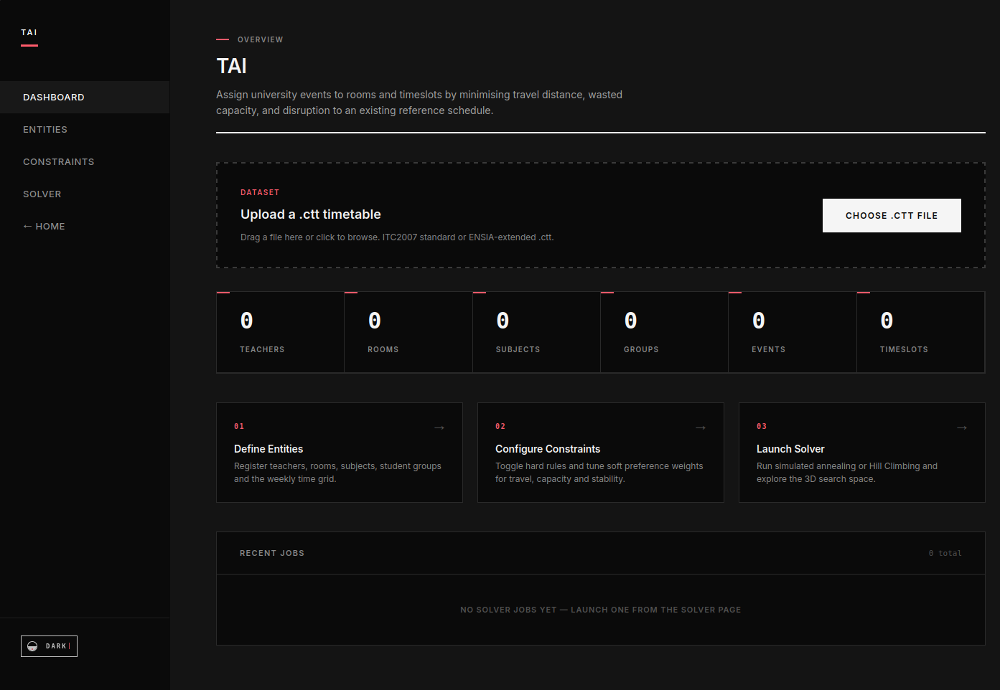
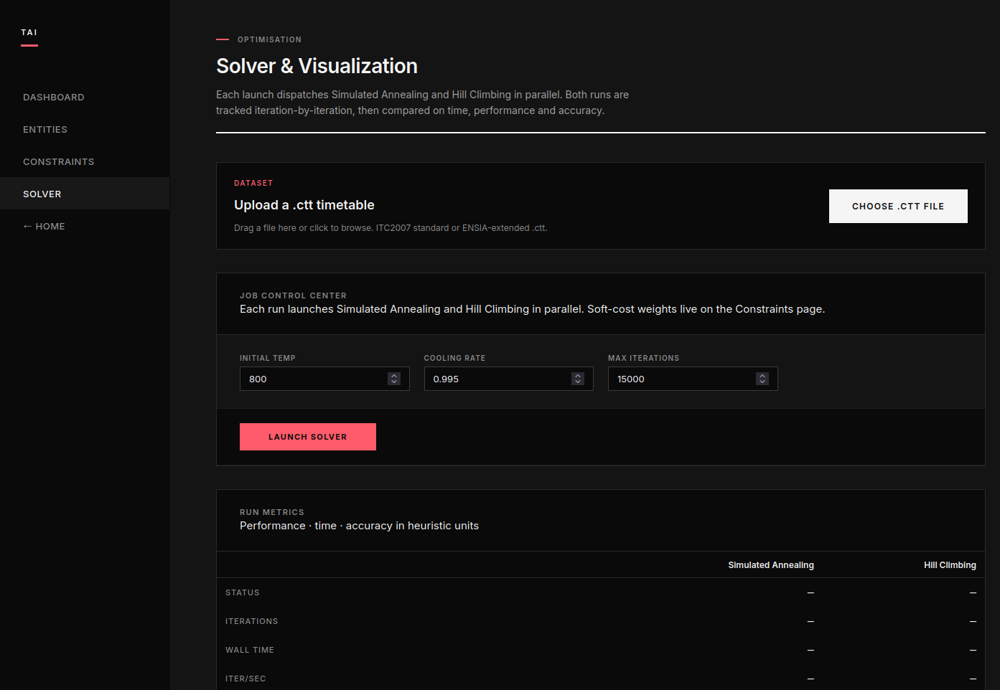

<div align="center">
  

  # AI Timetable Optimizer

  University course-to-room timetabling optimizer following the ITC2007
  curriculum-based format. Solves with **Simulated Annealing** and
  **Hill Climbing** in parallel; both runs are tracked iteration-by-iteration
  and compared on wall-time, performance and accuracy.
</div>

---

## A look at the app

### Landing — the 3D state-space hero



### Dashboard — drop a `.ctt`, get a project overview at a glance



### Solver — paired SA + HC runs with live metrics, charts and timetables



---

## Layout

```
src/core/             — CourseRoomAllocationProblem (hard constraints, soft cost)
src/algorithms/       — CSP initialiser, Simulated Annealing, Hill Climbing
backend/              — FastAPI app (parser, ORM, REST endpoints, job manager)
frontend/             — React + Vite UI (dashboard, solver, schedule views)
data/                 — Input datasets you upload (.ctt files)
cache/                — Auto-generated SQLite DB and other backend caches
```

## Prerequisites

* Python ≥ 3.10
* Node ≥ 18
* `pip` and `npm`

## Backend — install & run

From the project root:

```bash
pip install -e ".[dev]"
PYTHONPATH=$(pwd) python -m uvicorn backend.main:app --reload --port 8000
```

The API listens on `http://localhost:8000`. Interactive docs at
`http://localhost:8000/docs`.

A SQLite database is auto-created at `cache/timetabling.db` on first
request. Delete it to reset state.

To point at a different DB:

```bash
DATABASE_URL=sqlite:///path/to/your.db python -m uvicorn backend.main:app --port 8000
```

## Frontend — install & run

In a second terminal:

```bash
cd frontend
npm install
npm run dev
```

Vite serves the UI on `http://localhost:5173`. Open that in a browser;
the frontend talks to the backend on port 8000.

For a production bundle:

```bash
npm run build
```

## First-time use

1. Open the **Dashboard** (`/dashboard`) or **Solver** (`/solver`) page.
2. Drop a `.ctt` dataset into the upload box (drag-and-drop or click).
   The repo ships with `ensia.ctt` as a sample.
3. Optionally tune α β γ δ ε on the **Constraints** page. Defaults match
   the notebook (1.0, 0.5, 0.5, 1.0, 2.0).
4. Click **Launch Solver**. Both Simulated Annealing and Hill Climbing
   run in parallel; the `RunMetrics` panel and the two fitness curves
   update live, then the timetable / per-teacher / per-group views
   populate when the runs finish.

## Tests

```bash
PYTHONPATH=$(pwd) pytest
```
